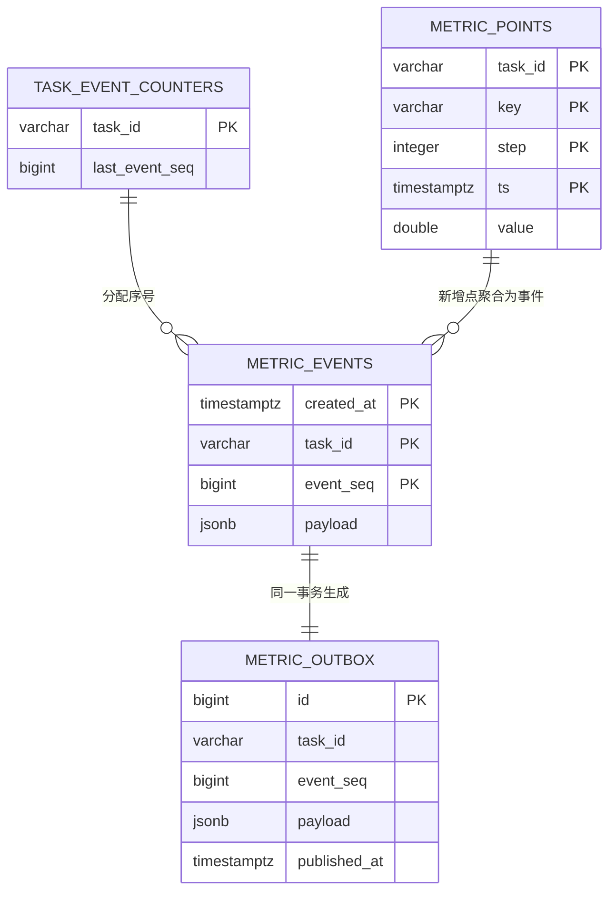
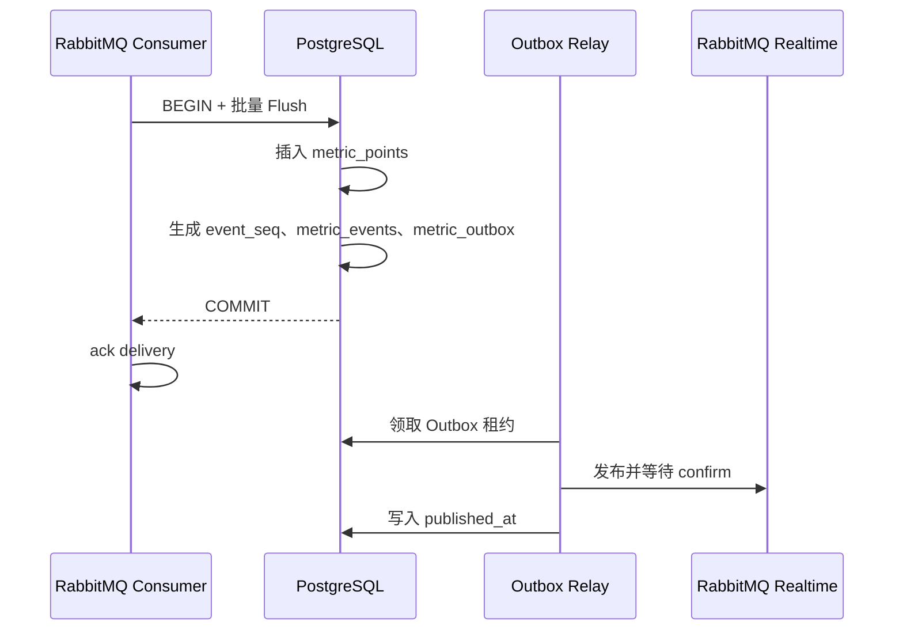

# 数据库以 PostgreSQL 分区表承载指标、事件与发布状态

作者：Metrics Pipeline Team  
最后更新：2026-09-01  
讨论：Issue #19  
状态：已实现

## 摘要

系统使用 PostgreSQL 16 作为指标事实、SSE 补发事件和实时发布状态的唯一持久化存储。`metric_points` 与 `metric_events` 按 UTC 自然日分区，worker 在同一事务中写入新增指标、事件日志和 Outbox 发布意图。该模型提供批量写入、重复投递幂等、SSE 断线补发和 168 小时数据窗口；历史曲线与摘要接口直接查询 PostgreSQL。

## 这套设计解决了写入确认与实时推送之间的一致性问题

指标写入包含两个必须同时成立的结果：查询接口可以读到已提交的指标，SSE 客户端可以收到对应事件。单独写指标后再发布 RabbitMQ 会留下故障窗口，进程在两步之间退出时会造成事件缺失。worker 因此将指标、事件和 Outbox 写进同一个 PostgreSQL 事务，Outbox relay 以已提交记录作为恢复点。

任务指标按时间范围查询与清理。日分区让 PostgreSQL 通过分区裁剪缩小查询范围，并将完整过期日的数据回收变为 `DROP TABLE` 操作。7 天保留窗口和当前验收规模适合 PostgreSQL 的批量写入与索引聚合。

## 四张核心表构成一条可恢复的数据链路



### `metric_points` 保存每个指标事实

| 列 | 类型 | 语义 |
| --- | --- | --- |
| `task_id` | `varchar(64)` | 训练或推理任务标识 |
| `key` | `varchar(32)` | 指标名，例如 `loss`、`lr` |
| `step` | `integer` | 任务内训练步数，约束 `step >= 0` |
| `ts` | `timestamptz` | 指标采样时间，按此列进行 UTC 日分区 |
| `value` | `double precision` | 指标值，约束排除 `NaN` 与正负无穷 |

主键为 `(task_id, key, step, ts)`。worker 使用 `INSERT ... ON CONFLICT DO NOTHING` 写入，完全相同的重投只产生一条事实记录。一个 sample 中的多个 key 会展开为多条 `metric_points`。

表声明为 `PARTITION BY RANGE (ts)`，子表命名格式为 `metric_points_YYYY_MM_DD`。父表包含两个索引：

| 索引 | 列 | 服务的访问路径 |
| --- | --- | --- |
| `metric_points_task_time` | `(task_id, key, ts, step)` | 历史曲线按任务、指标与时间范围过滤 |
| `metric_points_task_key_time_desc_covering` | `(task_id, key, ts DESC, step DESC) INCLUDE (value)` | 摘要查询定位每个 key 最新值，并从覆盖索引读取 `value` |

### `task_event_counters` 为每个任务分配连续事件序号

| 列 | 类型 | 语义 |
| --- | --- | --- |
| `task_id` | `varchar(64)` | 主键，与任务一一对应 |
| `last_event_seq` | `bigint` | 已分配的最大事件序号，默认 `0` |

写入事务先为本次任务创建计数器行，再按 `task_id` 排序锁定参与写入的行，并将每行序号递增一次。排序锁定保证同一批多任务写入使用稳定的锁顺序。每个任务的 SSE 事件由 `event_seq` 排序，客户端以 `task_id:event_seq` 作为断线续传游标。

数据库函数 `next_task_event_seq(task_id)` 保留为单任务连续序号分配能力；批量写入 SQL 直接在事务中更新计数器，以一次往返完成计数、事件与 Outbox 写入。

### `metric_events` 保存 SSE 的可重放事件

| 列 | 类型 | 语义 |
| --- | --- | --- |
| `created_at` | `timestamptz` | 事件写入时间，默认 `clock_timestamp()`，分区键 |
| `task_id` | `varchar(64)` | 事件所属任务 |
| `event_seq` | `bigint` | 任务内递增序号，约束大于 `0` |
| `payload` | `jsonb` | SSE 事件主体，约束为 JSON 对象 |

主键为 `(created_at, task_id, event_seq)`，满足 PostgreSQL 分区主键必须包含分区键的要求。索引 `metric_events_task_seq(task_id, event_seq)` 支持按任务与序号读取补发事件。事件查询固定限制在最近 168 小时，时间条件也参与分区裁剪。

一个事务会把同一任务、同一次 flush 中的真实新增指标聚合为一个事件：

```json
{
  "points": [
    { "loss": 0.82, "lr": 0.001, "step": 12, "ts": 1788246718000 }
  ]
}
```

### `metric_outbox` 保存待发布的实时事件

| 列 | 类型 | 语义 |
| --- | --- | --- |
| `id` | `bigint identity` | Outbox 记录主键，也是全局领取顺序 |
| `task_id`、`event_seq` | `varchar`、`bigint` | 任务内事件身份，联合唯一 |
| `payload` | `jsonb` | 发往 `metrics.realtime` 的事件内容 |
| `claimed_until`、`claim_token` | `timestamptz`、`uuid` | relay 领取租约与归属令牌 |
| `published_at` | `timestamptz` | RabbitMQ publisher confirm 到达后的发布时间 |
| `attempt_count`、`next_attempt_at` | `integer`、`timestamptz` | 失败重试计数与下一次可领取时间 |

`UNIQUE(task_id, event_seq)` 使同一事件只保留一份发布意图。relay 使用 `FOR UPDATE SKIP LOCKED` 领取候选记录，租约到期后其他实例可以接管。领取 SQL 还会检查同一任务中更小 `event_seq` 的未发布记录，保证实时发布顺序。

| 索引 | 条件 | 用途 |
| --- | --- | --- |
| `metric_outbox_pending_publish` | `published_at IS NULL` | 按 `next_attempt_at, id` 领取待发布记录，索引包含任务和序号 |
| `metric_outbox_expired_claim` | 未发布且存在领取令牌 | 快速发现已过期租约 |

## 一次 worker flush 在单个事务内完成事实写入与事件落库

worker 从 RabbitMQ 取出 batch 后，将每个 sample 的 `metrics` map 展开为 MetricPoint。达到 500 点或等待 100 ms 后，worker 调用 `MetricPointStore.Flush`。该函数使用 `READ COMMITTED` 事务，写入顺序如下：

1. 为超出当前预建窗口的采样日期创建日分区。
2. 为本次涉及的任务补齐 `task_event_counters` 行。
3. 使用 `unnest` 将 Go 侧的五个列数组展开为输入行。
4. 写入 `metric_points`；主键冲突的行自然被过滤。
5. 将真实新增点按 `(task_id, step, ts)` 聚合为 JSON payload。
6. 锁定任务计数器、分配 `event_seq`，写入 `metric_events` 与 `metric_outbox`。
7. 提交事务后，消费者确认对应 RabbitMQ delivery。



事务提交失败时，消费者将 delivery 重新入队。事务提交完成而 worker 在确认前退出时，消息会再次投递，主键冲突会吸收重复点，且只有真实新增点才会产生事件和 Outbox 记录。

## UTC 日分区和 168 小时保留窗口控制数据生命周期

迁移 `000001_initial_schema.sql` 创建 `ensure_metric_daily_partitions(reference_date, past_days, future_days)`。该函数为 `metric_points` 和 `metric_events` 同时创建 UTC 日分区。Compose 的迁移容器在启动期间预建当前日期前 8 天至后 2 天的分区。

worker 启动时再次预建分区，并每小时运行维护任务。`maintain_metric_retention(cutoff, batch_size)` 使用 PostgreSQL advisory transaction lock 串行化分区变更，默认按以下规则执行：

1. 删除截止日期之前的完整 `metric_points` 和 `metric_events` 分区。
2. 对截止日期当天、早于精确 cutoff 的指标和事件分批删除，默认批大小为 10,000。
3. 删除早于 cutoff 且已发布的 Outbox 记录。
4. 保留待发布的 Outbox 记录和每个任务的事件计数器，保证故障恢复和事件序号可以继续。

运行时配置将 `RETENTION_WINDOW` 固定为 `168h`，`PARTITION_MAINTENANCE_INTERVAL` 默认值为 `1h`。历史、摘要和 SSE 补发 SQL 同样带有 168 小时边界，因此读取语义与清理策略一致。

## 历史、摘要与审计查询各自使用专门的 SQL 路径

### 历史查询在每个 key 内独立降采样

`GET /api/v1/tasks/:task_id/metrics` 映射到 `query_metric_history.sql`。查询先按任务、key、时间、step 和 168 小时窗口过滤，再为每个 key 计算 `point_count`、`min_ts`、`max_ts`。

每个 key 的点数小于等于 `max_points` 时，SQL 原样返回该序列。点数超过上限时，SQL 计算桶大小并使用 PostgreSQL `date_bin(bucket_interval, ts, min_ts)` 聚合。每个桶返回：

- 最早的 `ts` 与同一最早排序位置的 `step`
- 指标均值 `v`
- 桶内最小值 `min`
- 桶内最大值 `max`

`date_bin` 直接执行时间桶计算，避免对每行重复执行 Unix epoch 提取、浮点除法与 `floor` 计算。响应中的 `bucket_ms` 大于 `0` 时，API 返回 `downsampled: true`。

`QueryHistory` 使用 `pgx.QueryExecModeExec` 执行未预编译语句。每次请求都根据实际的 key、时间与 step 过滤条件生成执行计划，使不同选择性的查询采用对应访问路径。

### 摘要查询从覆盖索引读取最新值并聚合统计量

`GET /api/v1/tasks/:task_id/summary` 映射到 `query_metric_summary.sql`。`key_stats` CTE 对每个 key 计算 `min`、`max`、`avg`；`key_latest` 使用 `DISTINCT ON (key)` 与 `ORDER BY key, ts DESC, step DESC` 取最新值；`task_latest` 则从这些最新记录中确定任务的 `last_step` 和 `updated_at`。

覆盖索引把 `value` 放在索引叶子节点中，摘要查询可以在较高缓存命中率下减少 heap 读取。

### 审计查询用于验收时的完整性对账

`GET /api/v1/admin/tasks/:task_id/audit` 返回 `point_count`、`distinct_steps`、首尾 step、key 集合和 `missing_steps`。`missing_steps` 通过 `generate_series` 计算，仅在首尾 step 差值小于等于 100,000 时展开，避免异常范围占用大量数据库资源。

审计中 `point_count` 表示展开后的 metric point 数；`distinct_steps` 表示任务中的唯一 step 数。写入压测将这两个字段、首尾 step、key 集合和缺失 step 与生成端的期望值逐项比较。

## 设计取舍

### PostgreSQL 分区表与当前数据规模匹配

我们选择 PostgreSQL 原生 `RANGE` 日分区，因为应用已经要求 PostgreSQL 与 `pgx`，而指标、事件、Outbox 和序号需要共同的事务边界。日分区同时服务时间范围查询和 168 小时回收，运行模型简单且可由标准 PostgreSQL 工具检查。

TimescaleDB 可提供更多时序特性，带来扩展依赖、部署复杂度和迁移成本。当前 N1-N6 目标由原生分区、批量写入、覆盖索引和 SQL 分桶满足；持续压测显示单实例容量接近阈值时，再以实际数据评估时序扩展。

### Outbox 让数据库提交与消息发布拥有恢复点

我们将 Outbox 记录和事件日志放在指标写入事务内。事务提交后，relay 可以持续领取并重试 Outbox，从而把 RabbitMQ 发布故障转为可观察、可恢复的数据库状态。

同步发布 RabbitMQ 后再写数据库会将发布确认和数据提交分成两条独立路径，故障窗口会出现实时事件缺失或数据库事实缺失。Outbox 带来一张表和后台 relay，换来可重试的发布意图及每个任务的事件顺序。

### 事件按任务分配序号，实时广播保持顺序

全局序号会把所有任务的事件竞争集中在同一个计数器上。`task_event_counters` 让不同任务独立并发写入，同一任务依据行锁获得连续 `event_seq`。SSE 客户端维护任务级游标即可进行断线续传。

### 时间桶聚合在数据库端完成，响应大小具有确定上界

应用层取回全部点再降采样会增加网络传输、Go 堆内存与响应延迟。历史 SQL 在 PostgreSQL 内部过滤、统计和聚合，`max_points` 控制每个 key 的返回量，API 只组装查询结果。

## 当前数据库版本可通过迁移安全演进

迁移文件位于 `migrations/`，当前版本如下：

| 版本 | 文件 | 内容 |
| --- | --- | --- |
| 1 | `000001_initial_schema.sql` | 核心表、分区函数和索引 |
| 2 | `000002_retention_maintenance.sql` | 168 小时保留函数 |
| 3 | `000003_metric_query_covering_index.sql` | 摘要查询覆盖索引 |

`schema_migrations` 记录每个已应用迁移的版本与 SHA-256 校验和。迁移工具在 PostgreSQL 健康后执行，重复执行会依据版本记录跳过已应用脚本。已有环境通过以下命令验证并执行迁移：

```powershell
docker compose run --rm migrate
```

新增数据库变更应新增一个按序编号的迁移文件，保持既有迁移文件内容稳定。迁移发布后使用下列 SQL 检查分区和索引：

```sql
SELECT parent.relname AS parent_table, child.relname AS partition_name
FROM pg_inherits inheritance
JOIN pg_class parent ON parent.oid = inheritance.inhparent
JOIN pg_class child ON child.oid = inheritance.inhrelid
JOIN pg_namespace namespace ON namespace.oid = child.relnamespace
WHERE namespace.nspname = 'public'
ORDER BY parent_table, partition_name;

SELECT tablename, indexname, indexdef
FROM pg_indexes
WHERE schemaname = 'public'
  AND tablename IN ('metric_points', 'metric_events', 'metric_outbox')
ORDER BY tablename, indexname;
```

对历史或摘要查询做性能变更时，使用真实任务规模执行 `EXPLAIN (ANALYZE, BUFFERS)`，并将 P95 结果与 N4 小于 200 ms、N5 小于 100 ms 的验收阈值一同记录。
