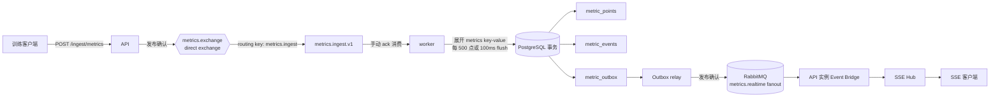
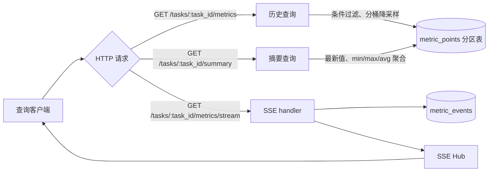

# 设计文档


## 数据链路

### 1. 写入链路



客户端以 `task_id` 和一组 sample 调用 `POST /api/v1/ingest/metrics`。API 校验请求大小、step、时间戳和指标 key 后，将原 batch 作为一条持久化消息发布到 `metrics.ingest`；收到 RabbitMQ publisher confirm 才返回 `200 accepted`，发布重试耗尽时返回 `503 MQ_UNAVAILABLE`。

worker 按手动确认方式消费消息，将一个 sample 的多个 `metrics` key-value 展开为多条 MetricPoint。它累计 500 个 MetricPoint 或等待 100ms 后执行一次 PostgreSQL 事务：以 `(task_id, key, step, ts)` 唯一键写入 `metric_points`，真实新增的数据同时写入 `metric_events` 与 `metric_outbox`。事务提交后才确认关联 delivery；事务失败时 `nack(requeue=true)`，因此 broker 会重新投递该消息。

Outbox relay 从 `metric_outbox` 领取已提交事件，取得 RabbitMQ 发布确认后标记已发布。事件进入 `metrics.realtime` fanout exchange，各 API 实例通过独立临时队列接收并投递给本地 SSE Hub。指标、事件日志和发布意图处于同一个数据库事务，API、worker 或 RabbitMQ 短暂故障都能由确认、重投和 Outbox 重试恢复。

### 2. 读取链路



历史曲线和任务摘要直接读取 PostgreSQL，不经过 RabbitMQ。历史接口支持 key、时间和 step 过滤；当某个序列超过 `max_points` 时，查询以 `date_bin` 按时间桶聚合，返回每桶最早的 `(ts, step)` 代表点及 `avg`、`min`、`max`。摘要接口按 task 聚合各 key 的最新值、最小值、最大值和平均值，覆盖索引 `(task_id, key, ts DESC, step DESC) INCLUDE (value)` 支持该访问路径。

SSE 客户端连接时，handler 先注册到本地 Hub，再读取该任务的事件序号边界和事件日志。携带 `Last-Event-ID` 时，服务按 `event_seq` 补发缺失事件；首次连接从当前最新序号开始订阅。补发完成后，连接期间缓存及后续由 Event Bridge 送入 Hub 的实时事件按序写入连接。每个事件带有 `task_id:event_seq`，客户端可用此游标在 API 重启或断线后继续接收。


## 关键设计取舍

### 存储方案选择

系统采用 PostgreSQL 16 作为唯一的持久化存储，使用原生 `RANGE` 日分区保存时序指标与 SSE 事件。该选择直接满足任务书规定的 PostgreSQL、`pgx` 和事务批量写入约束，同时为 `metric_points`、`metric_events`、Outbox 与事件序号提供同一数据库事务边界。

指标数据以时间范围访问和清理为主，按 UTC 自然日分区能够让历史查询通过分区裁剪缩小扫描范围，让完整过期日通过 `DROP TABLE` 快速回收空间。当前数据规模由 PostgreSQL 的批量写入、覆盖索引和 SQL 时间分桶支撑；`metric_points` 使用 `(task_id, key, ts, step)` 与 `(task_id, key, ts DESC, step DESC) INCLUDE (value)` 两条索引分别服务历史曲线和摘要查询。

TimescaleDB、预聚合表和缓存属于后续容量扩展手段。N4、N5 持续超过目标值，或七天窗口的单实例查询与写入量持续增长时，再依据实际压测结果评估引入时机。


### SSE扇出路径

实时事件使用 RabbitMQ 的 `metrics.realtime` fanout exchange。每个 API 实例启动 Event Bridge 时声明一个独占、自动删除的临时队列并绑定该 exchange，因此每个实例都会收到完整事件流，再由实例内的 SSE Hub 投递给本机连接。该模型支持 API 水平扩容，保持客户端连接与本机内存订阅的简单边界。

worker 在写入指标的同一 PostgreSQL 事务中生成 `metric_events` 和 `metric_outbox`。Outbox relay 取得发布确认后才标记记录已发布，发布失败的记录按退避时间再次领取。这个设计让实时广播以 Outbox 为恢复点，事件日志以 `event_seq` 为补发和排序依据。

API Event Bridge 在 Hub 成功处理事件后才确认 RabbitMQ delivery，并记录每个 task 的最大已处理序号。SSE handler 在注册 Hub 后读取事件边界与事件日志，`Last-Event-ID` 指定的缺口按序补发；实时事件与补发事件通过 `event_seq` 去重。该路径同时满足低延迟推送、实例扩展和断线续传。


### 表结构设计

核心表由迁移 `000001_initial_schema.sql` 创建，职责如下：

| 表 | 作用与关键约束 |
| --- | --- |
| `metric_points` | 原始指标事实表，主键为 `(task_id, key, step, ts)`；按 `ts` 的 UTC 日分区，保留每个指标值的完整时间与 step 语义。|
| `metric_events` | 已提交指标生成的 SSE 事件日志，保存 `task_id`、递增 `event_seq` 和 JSON payload；按 `created_at` 日分区，为断线补发提供持久来源。|
| `metric_outbox` | 已提交且待发布的实时事件，保存领取租约、重试次数、下次重试时间和 `published_at`；`UNIQUE(task_id, event_seq)` 约束每个事件的发布意图。|
| `task_event_counters` | 每个 task 的事件序号计数器；worker 在事务内锁定并递增对应行，为同一 task 分配连续的 SSE 序号。|

`metric_points` 的主键吸收完全相同的重投。历史与摘要查询使用 task、key、时间与 step 条件；覆盖索引将 `value` 包含在索引叶子节点中，减少摘要聚合时的回表读取。`metric_outbox` 的待发布索引和过期租约索引服务 relay 的领取与故障接管。


### 幂等设计

幂等性由投递、存储和实时事件三个层面共同保证。

1. **投递层。** API 的 publisher 为一次发布生成一份 `IngestMessage`，同一次 RabbitMQ 重试复用其 `message_id` 和 `correlation_id`。worker 使用手动 ack，只有 PostgreSQL 事务提交后才确认 delivery；提交失败的 delivery 通过 `nack(requeue=true)` 回到队列。
2. **存储层。** `metric_points` 以 `(task_id, key, step, ts)` 为主键，写入 SQL 使用 `INSERT ... ON CONFLICT DO NOTHING`。同一批数据多次到达时，首次写入产生记录，后续写入产生零条新增行。
3. **实时层。** 只有真实新增指标才会生成 `metric_events` 和 `metric_outbox`。relay 在发布确认与数据库标记之间发生重启时，事件会再次发布；Event Bridge、SSE 连接和 `Last-Event-ID` 均按 `(task_id, event_seq)` 排序并过滤已处理序号，客户端保持单次可见的有序事件流。


### 脏数据接收

系统将相同 `(task_id, key, step)` 且携带不同 `ts` 的数据视为两条独立原始观测。四字段主键保留两个时间戳与对应 value，使上游时钟漂移、补传或同一步多次采样具备可追溯证据；相同四字段的重传继续由主键幂等吸收。

该策略要求调用方在重试同一采样点时复用首次上报的时间戳。audit 查询会检查每个 `(key, step)` 的不同时间戳数量，并将发现的重复 step 以 `task_id`、key、step 和 timestamps 记录为结构化告警。v1 audit 响应保持任务书规定的 `point_count`、`distinct_steps` 与 `missing_steps` 字段；异常详情由日志支持排查。

历史查询按 `ts, step` 排序，时间降采样按时间桶聚合，因此同一步的多条时间观测都能参与曲线计算。该规则保存数据完整性，也让异常采样在检索阶段保持可解释性。


### 保留策略

原始指标 `metric_points` 与 SSE 事件 `metric_events` 的保留窗口为 168 小时。worker 启动后立即执行一次分区维护，之后按 `PARTITION_MAINTENANCE_INTERVAL` 周期执行，默认周期为一小时；截止时间统一按 `UTC now - 168h` 计算。

维护任务预建过去 8 天到未来 2 天的 UTC 日分区。预建函数使用 `CREATE TABLE IF NOT EXISTS` 保证重复执行安全；清理函数通过 PostgreSQL advisory lock 串行化分区删除与边界数据删除。截止日之前的完整日分区直接删除，截止日所在分区按每批最多 10,000 行删除 `ts` 或 `created_at` 早于截止时间的数据。该组合同时控制清理事务长度、保留精确的七天窗口并减少大量过期行的逐条删除成本。

`metric_outbox` 仅清理已成功发布且过期的记录，待发布记录持续保留并参与 relay 重试。`task_event_counters` 随 task 长期保存，使任务在后续再次写入时继续使用更大的 `event_seq`，保证 SSE 游标单调递增。


## 问题

### **1. RabbitMQ 的 `prefetch=16` 限制了 worker 的在途消息数**

`Qos(prefetch, 0, false)` 规定单个 consumer 在收到 ack 前，RabbitMQ 最多投递多少条消息。

worker 必须完成落库并 ack 后，RabbitMQ 才继续补充新的 delivery。`16` 在批量落库时很容易形成供给不足。
我将默认值调为 `prefetch=500`，让 worker 在数据库提交期间仍保持足够的可消费 delivery；同时保留手动 ack，因此重复投递和崩溃恢复语义保持成立。


### **2. 覆盖索引减少了回表和排序压力**

数据库要在几万甚至几十万条数据中，按照 `key` 分组，并按照 `ts`（时间）和 `step` 倒序排列，来取最新的一条。如果让数据库在内存或磁盘里硬生生地算排序，CPU 和内存“压力”会非常大，导致查询变慢。

所以新增索引为：
`task_id, key, ts DESC, step DESC INCLUDE (value)`
查询按任务和指标 key 过滤、按时间处理，同时需要 `value` 聚合。覆盖索引让 PostgreSQL 更容易从索引直接获得所需列，摘要查询 N5 已稳定在约 56ms，满足 `<100ms`。


### 3. 分桶表达式本身也消耗了大量 CPU

原分桶方式对每一行执行 `EXTRACT(EPOCH)`、数值除法和 `FLOOR`。28,800 点/key 的查询中，这些计算会执行数万次。
我改为 PostgreSQL 原生 `date_bin(bucket_interval, ts, origin)`。它直接按时间间隔分桶，同时保持“每个桶取最早 `(ts, step)` 作为代表点，随后利用group by 通过key聚合，算出 avg/min/max”。数据库执行时间已降到约 140-146ms。


## 验收压测

验收脚本入口为 `cmd/perf/main.go`。在项目根目录启动依赖后执行：

```powershell
docker compose up --build --detach --wait
go run ./cmd/perf --batch-size 10 --report perf-report.json
```

该命令默认运行 10 分钟。脚本将 JSON 结果写入 `perf-report.json`，终端打印各阶段状态、检查项通过率和单项结果。30 秒冒烟可使用 `--duration 30s`；该模式的 N1 会按“持续时间不足 10 分钟”判定为失败，其余 N2-N6 仍可用于快速检查。

### N1 写入吞吐与零丢失

**验收内容。** 50 个并发任务，每个任务每秒生成 10 个业务 sample，持续至少 10 分钟。每个 sample 包含 `loss` 与 `lr`，因此写入负载为 500 sample/s、1000 MetricPoint/s。验收要求所有预期数据最终落库。

**压测过程。** 脚本以每条 HTTP 上报 10 个 sample 的 batch 发送数据，并在写入结束后轮询 `/api/v1/admin/tasks/{task_id}/audit`。每个任务的预期值与实际值会比较 `point_count`、`distinct_steps`、`keys` 和 `missing_steps`。

**结果。** 最近一次正式 10 分钟运行通过：500 sample/s，审计对账通过。报告同时记录 `metric_points_per_second: 1000`，用于展示数据库展开后的实际点写入速率。

### N2 重复上报与幂等落库

**验收内容。** 在 N1 的持续写入中注入 2% 完整重复 batch，验证重复投递后数据库中每个唯一 MetricPoint 只保留一行。

**压测过程。** 模拟器以 `DuplicateRate=0.02` 随机重复已发送的 batch。worker 使用手动 ack，数据库以 `(task_id, key, step, ts)` 为唯一键，并通过 `INSERT ... ON CONFLICT DO NOTHING` 吸收重复点。压测结束后，audit 的期望值和实际值必须完全一致。

**结果。** 通过。报告项 `N2 duplicate persistence` 的 `value=0`、`threshold=0`、`pass=true`。对于本压测的两个指标 key，正常关系为 `point_count = distinct_steps × 2`；例如 `distinct_steps=5880` 对应 `point_count=11760`。

### N3 消费者 SIGKILL 后恢复

**验收内容。** worker 在消费期间被强制终止并重新启动后，MQ 中已投递但尚未确认的数据需要重新消费，最终数据保持零丢失、零重复。

**压测过程。** N1 上报启动 1 秒后，脚本执行 `docker compose kill worker`。Docker Compose 默认向容器发送 `SIGKILL`，等价于进程级 `kill -9`。脚本等待 2 秒，再执行 `docker compose up --detach --wait worker`，持续写入保持运行直至 10 分钟结束，随后执行 audit 对账。

**结果。** 通过。报告项 `N3 worker recovery` 的 `value=0`、`threshold=0`、`pass=true`。该结果同时要求终止命令、重启命令和最终 audit 均成功。

### N4 8 小时历史曲线查询

**验收内容。** 查询单个任务 8 小时曲线，每个 key 约 28,800 个原始点，接口参数为 `max_points=500`，HTTP P95 低于 200ms。

**压测过程。** 脚本为一个已完成的压测任务补充 28,800 个秒级 sample，每个 sample 含 `loss` 和 `lr`。脚本轮询历史接口，确认两个序列均已降采样到 500 点后，对 `GET /api/v1/tasks/{task_id}/metrics?max_points=500` 连续顺序请求 20 次，排序后取第 19 个结果作为 P95。

**结果。** 最近一次正式 10 分钟报告为 `209.584ms`，目标为 `<200ms`，该项当前失败。分桶表达式已由 `FLOOR(EXTRACT(EPOCH ...))` 改为 `date_bin(...)`，数据库执行实测约 140-146ms；后续将通过写入侧统计表消除全量历史查询的第一遍统计扫描，再重跑正式验收。

### N5 任务摘要查询

**验收内容。** 查询单个任务全量指标摘要，返回各 key 的最新值、最小值、最大值和平均值，HTTP P95 低于 100ms。

**压测过程。** N4 的 8 小时种子数据准备完成后，脚本对 `GET /api/v1/tasks/{task_id}/summary` 连续顺序请求 20 次，排序后取第 19 个结果作为 P95。查询覆盖索引为 `(task_id, key, ts DESC, step DESC) INCLUDE (value)`，减少摘要聚合的回表与排序成本。

**结果。** 通过。最近一次正式 10 分钟报告的 P95 为 `56.124ms`，目标为 `<100ms`。

### N6 SSE 推送延迟

**验收内容。** 新指标成功落库后，SSE 订阅方在 1 秒内接收到对应数据。

**压测过程。** 脚本先连接 `GET /api/v1/tasks/{task_id}/metrics/stream` 并等待 HTTP 200，然后连续上报 20 个单点 batch。每个点的 `ts` 在发送前写入当前毫秒时间，SSE 客户端收到 `data:` 事件后计算 `received_at - point.ts`。20 条数据中的最大延迟作为验收值。

**结果。** 通过。最近一次正式 10 分钟报告的最大 SSE 延迟为 `463ms`，目标为 `<1000ms`。


